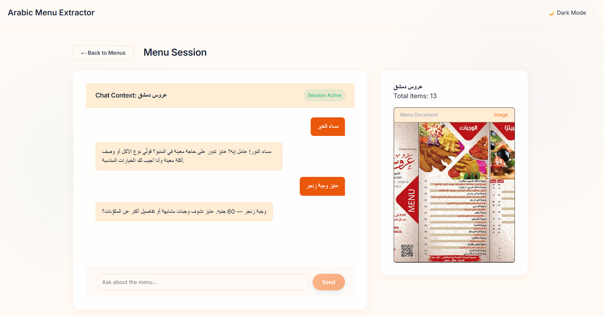
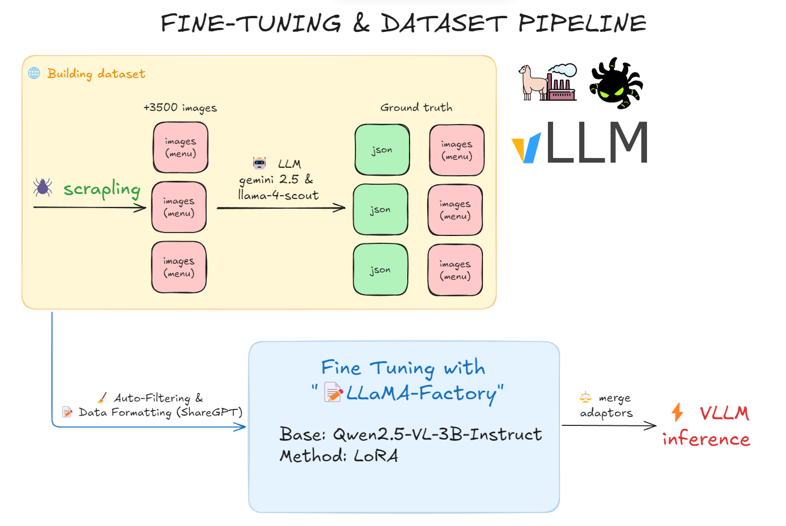
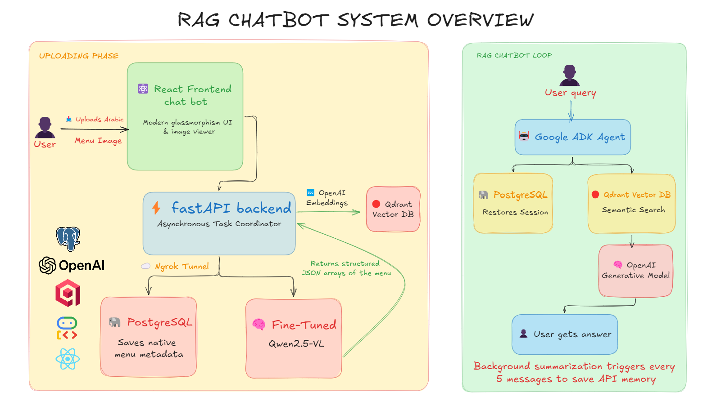

# 🍽️ Arabic Menu Extractor & Chat RAG System: End-to-End Fine-Tuning Pipeline

[](https://www.python.org/)
[](https://github.com/hiyouga/LLaMA-Factory)
[](https://github.com/vllm-project/vllm)
[](https://github.com/google/agentic-development-kit)
[](https://openai.com/)
[](https://www.postgresql.org/)
[](https://qdrant.tech/)
[](https://react.dev/)

**Links:**
- **Model:** [mohamedashraff22/arabic-menu-ocr-v2](https://huggingface.co/mohamedashraff22/arabic-menu-ocr-v2)
- **Dataset:** [mohamedashraff22/arabic-menus-dataset](https://huggingface.co/datasets/mohamedashraff22/arabic-menus-dataset)



A complete, end-to-end machine learning and software engineering pipeline that digitizes complex Arabic restaurant menus using a specialized, **Fine-Tuned Vision-Language Model (VLM)**, and provides an intelligent conversational **Retrieval-Augmented Generation (RAG)** interface for users to chat with the extracted menu.

This repository covers the entire lifecycle: scraping the raw data, auto-generating a ground-truth dataset, fine-tuning **Qwen2.5-VL-3B-Instruct**, and building a highly optimized full-stack Web Application powered by **Google's Agentic Development Kit (ADK)**, FastAPI, PostgreSQL, and React.

---

## 🏗️ Architecture & Tech Stack

Our system is logically divided into the Machine Learning backend, and the AI Application RAG infrastructure.

### 1. Machine Learning & Fine-Tuning Stack (Core)
* **Data Scraping:** [Scrapling](https://github.com/D4Vinci/Scrapling) (Undetectable, high-speed web scraping).
* **Dataset Generation:** Meta `Llama-4-Scout-17B` (via Groq API) & Google `Gemini 2.5 Flash` (via Google API).
* **Fine-Tuning Framework:** [LLaMA-Factory](https://github.com/hiyouga/LLaMA-Factory) (LoRA).
* **Base Model:** `Qwen/Qwen2.5-VL-3B-Instruct`.
* **Inference Engine:** `vLLM` (PagedAttention) & Hugging Face `Transformers`.

### 2. Application & RAG Stack
* **Agent Framework**: **Google Agentic Development Kit (ADK)** for deterministic session management, event compaction, and conversational state tracking.
* **Backend**: **FastAPI (Python)** for highly concurrent, asynchronous API routing.
* **Vector Database**: **Qdrant** for storing dense vectors of extracted menu items and executing blazing-fast semantic searches.
* **Relational Database**: **PostgreSQL** serving two purposes: persisting custom application metadata (menus/items), and natively hooking into ADK's `DatabaseSessionService` to store LLM state across sessions.
* **Language Models**: Generic generation and embedding APIs to parse user intent, perform vector searches, and conduct warm conversational chats.
* **Frontend**: **React (Vite)** with modern vanilla CSS, implementing a premium, glassmorphism-inspired, dark-mode-first aesthetic with a built-in interactive image viewer.

---

## 🧠 Model Fine-Tuning Pipeline

### 1️⃣ Data Collection (`Scrapling`)
To gather authentic data, we scraped menus from the internet using **Scrapling**. Because of its highly resilient, undetectable nature, it efficiently bypassed anti-bot protections, yielding over **+3,000 raw Arabic restaurant menu images** directly from delivery platforms and catalog websites.

### 2️⃣ Auto-Generating Ground Truth Data (Groq/Llama-4 + Google/Gemini-2.5)
Because annotating thousands of dense Arabic menus manually is impossible, we built an automated data pipeline:
* **LLM Engines:** We utilized a dual-engine extraction setup leveraging both Meta's `Llama-4-Scout-17B` (hosted on Groq) and Google's `Gemini 2.5 Flash` (via Google API) to perform robust zero-shot JSON extraction on the raw images.
* **Auto Key-Rotation:** To bypass severe rate limits, we implemented a continuous multi-key rotation script that automatically cycles through API keys upon failure.
* **Garbage Cleanup:** A strict filtering algorithm dropped any image that outputted fewer than 3 items, automatically deleting hallucinations and irrelevant data from the final training set.

### 3️⃣ Fine-Tuning (`LLaMA-Factory`)
We formatted the cleaned data into a `ShareGPT` mixed-modal structure and fine-tuned the model natively in **LLaMA-Factory**:
* **Base Model:** `Qwen2.5-VL-3B-Instruct`
* **Method:** LoRA (Rank: 16, Target: All Linear Layers)
* **Hardware:** NVIDIA L40S / T4
* **Precision:** `bfloat16`

### 4️⃣ Merging & Deployment (`vLLM`)
Once the LoRA weights converged smoothly, we merged them directly into the base Qwen2.5-VL model weights. The final standalone model is fully compatible with **vLLM**, allowing for lightning-fast, high-throughput generations in production environments using PagedAttention.



---

## 🖥️ System Architecture Deep Dive (App & RAG Layer)

Rather than just wrapping an API call in a basic dashboard, this system implements a fully autonomous, production-ready AI conversational pipeline designed for enterprise scale and UX perfection. At a high level, the system functions as a seamless loop: users upload an image which is instantly digitized into structured data via our fine-tuned VLM. This data is then mathematically vectorized and injected into a memory-aware Agent ecosystem. The conversational Agent sits between the user and the raw menu data, executing complex semantic searches to answer queries naturally. To ensure this runs infinitely without crashing or costing a fortune in tokens, the underlying architecture actively manages its own memory state, database caching, and chat summarization.

Below is a breakdown of the core mechanics making this pipeline stable and production-ready:

### 1. Event Compaction (Fixing LLM Memory Bottlenecks)
In long conversational RAG sessions, injecting massive JSON menu arrays plus the growing back-and-forth chat history rapidly exhausts an LLM's context window. More crucially, it causes token generation costs to skyrocket.
* **The Solution**: We integrated Google ADK's **Context Compaction**. Every 5 messages, a background routine extracts the raw historical events from the session, summarizes the core context logically, and drops the raw historical tokens. The LLM then only receives the dense summary + the most recent messages, maintaining infinite chat length while capping memory limits.

### 2. Session TTL & State Cleanup
To prevent indefinite database bloat, a background **Time-To-Live (TTL) worker** periodically purges inactive sessions from PostgreSQL. Before deleting a stale session, the system summarizes the context into a lightweight `last_session_summary`, allowing returning users to seamlessly resume conversations days later without server bloat.

### 3. Integrated ADK State Management
We do not use Redis for session management. We implemented ADK's `DatabaseSessionService` directly hooked into **PostgreSQL** via async SQLAlchemy.
* This means every LLM execution, state change, and tool invocation is transparently transactional and stored safely alongside our application’s primary relational data (Menus and Item rows). If the Python server abruptly shuts down, no conversational context is lost.

### 4. Vector Semantic Search RAG (Qdrant)
To prevent the LLM from hallucinating over large 200-item menus, we use an intricate RAG toolchain:
* At upload time, every extracted item (e.g. *"كباب مشوي بسعر 45"*) is embedded using an OpenAI embedding model. The vectors are upserted into **Qdrant**.
* The ADK Agent is equipped with a `search_menu` tool. If a user asks "What spicy food do you have?", the agent doesn't scan a text file. It dynamically queries Qdrant mathematically, pulls the closest semantic matches, and synthesizes an answer instantly.

### 5. Egyptian Persona Prompting & Dark-Mode Frontend
We focused heavily on the **Human Experience**.
* **The Prompt Engineering**: By default, AI assistants sound extremely robotic like automated customer service IVRs ("Choose 1 to do X"). We strictly prompt-engineered the agent to enforce an authentic **Egyptian Arabic dialect (عربي مصري)**. It greets users warmly, stays concise, and never breaks character to mention system variables (like UUIDs).
* **The React UI**: We built a custom front-end featuring a highly polished, glassmorphism-inspired dark mode. Rather than displaying blocky unstructured JSON data, the interface elegantly parses the extracted menu and dynamically frames the original uploaded image in a native image viewer right next to the active chat session.



---

## 🚀 Quick Start & Usage

Both the final model and the dataset are open-sourced on Hugging Face.

### Standard Inference (Transformers)
You must install the Qwen utilities alongside transformers:
```bash
pip install torch transformers accelerate qwen-vl-utils[decord]==0.0.8
```

```python
from transformers import Qwen2_5_VLForConditionalGeneration, AutoProcessor
from qwen_vl_utils import process_vision_info
import torch

model_id = "mohamedashraff22/arabic-menu-ocr-v2"

# Load Merged Model
model = Qwen2_5_VLForConditionalGeneration.from_pretrained(
    model_id, torch_dtype=torch.bfloat16, device_map="auto"
).eval()
processor = AutoProcessor.from_pretrained(model_id)

prompt = """Extract every food or drink item and its price from this menu image.
Keep item names and prices exactly as written in the image.
If an item has multiple sizes, list each size as a separate entry.
Only include items that have a visible price. Skip anything without a price.
Return a JSON object with one key "items" containing an array. Each item has "name" (string) and "price" (string)."""

messages = [
    {
        "role": "user",
        "content": [
            {"type": "image", "image": "file:///path/to/menu.jpg"},
            {"type": "text", "text": prompt}
        ]
    }
]

text = processor.apply_chat_template(messages, tokenize=False, add_generation_prompt=True)
image_inputs, video_inputs = process_vision_info(messages)

inputs = processor(
    text=[text], images=image_inputs, videos=video_inputs, padding=True, return_tensors="pt"
).to(model.device)

with torch.inference_mode():
    generated_ids = model.generate(
        **inputs, max_new_tokens=2048, do_sample=False, repetition_penalty=1.15
    )
    
generated_ids_trimmed = [out_ids[len(in_ids):] for in_ids, out_ids in zip(inputs.input_ids, generated_ids)]
print(processor.batch_decode(generated_ids_trimmed, skip_special_tokens=True)[0])
```

### High-Speed Inference (vLLM)
For production workloads, load the model into vLLM:
```python
from vllm import LLM, SamplingParams
from transformers import AutoProcessor

model_id = "mohamedashraff22/arabic-menu-ocr-v2"
processor = AutoProcessor.from_pretrained(model_id)

llm = LLM(
    model=model_id,
    trust_remote_code=True,
    dtype="bfloat16",
    max_model_len=4096,
    gpu_memory_utilization=0.60
)

# Insert the exact training prompt
vllm_messages = [{"role": "user", "content": [{"type": "image"}, {"type": "text", "text": "YOUR_PROMPT_HERE"}]}]
formatted_prompt = processor.apply_chat_template(vllm_messages, add_generation_prompt=True, tokenize=False)

outputs = llm.generate({
    "prompt": formatted_prompt,
    "multi_modal_data": {"image": "file:///path/to/menu.jpg"}
}, sampling_params=SamplingParams(temperature=0.0, max_tokens=3000, repetition_penalty=1.15))

print(outputs[0].outputs[0].text)
```

---

## 🤝 Contributing
Feel free to open an issue or submit a Pull Request if you'd like to improve the extraction accuracy, expand the dataset, or optimize the web architecture.